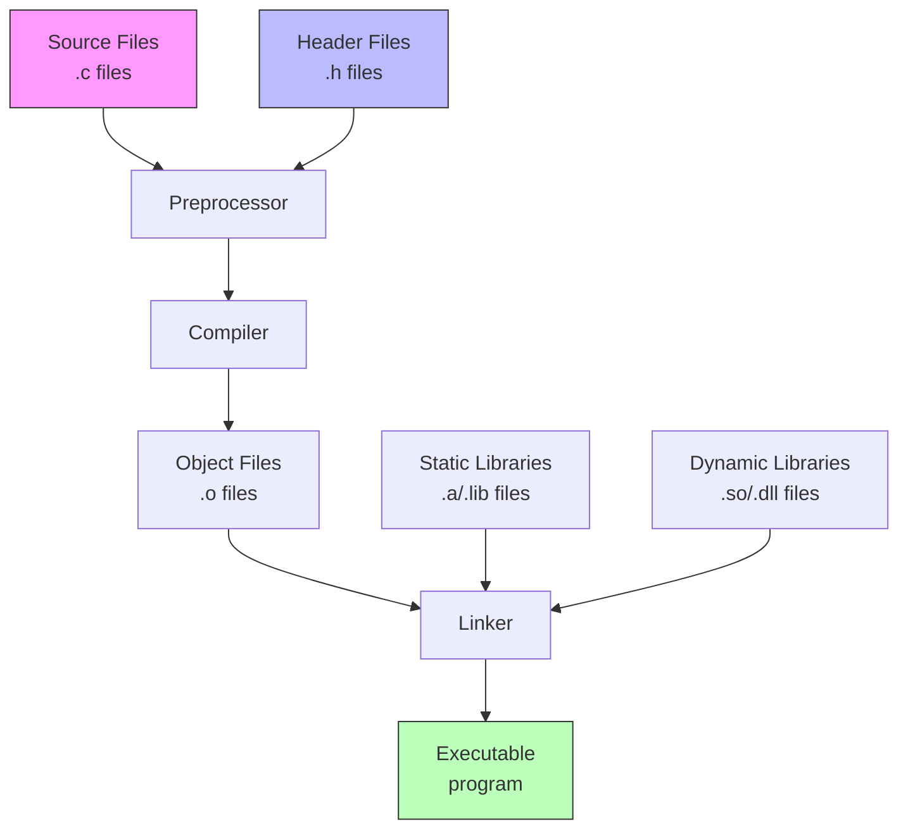

# Compilation Process and Multiple File Handling

## How Compiler Handles Multiple Files

When working with multiple source files in C, the compilation process involves several steps to transform your code into an executable. Here's how it works:

1. **Each source file (.c) is compiled separately** into an object file (.o)
2. **Header files (.h) are included** through the preprocessor
3. **The linker combines** all object files into the final executable

### Key Concepts:

- **Separate Compilation**: Each `.c` file is treated as a compilation unit
- **Header Guards**: Prevent multiple inclusions of the same header
- **External Linkage**: Functions and variables can be shared across files
- **Static Linkage**: Limits scope to single compilation unit

## The Complete Compilation Process



### Detailed Steps:

1. **Preprocessing Stage**
   - Expands macros
   - Includes header files
   - Removes comments
   - Handles conditional compilation (#ifdef, etc.)

2. **Compilation Stage**
   - Converts preprocessed code to assembly
   - Performs syntax checking
   - Optimizes code
   - Generates object code

3. **Assembly Stage**
   - Converts assembly code to machine code
   - Creates object files (.o files)
   - Each source file gets its own object file

4. **Linking Stage**
   - Combines all object files
   - Resolves external references
   - Links with libraries
   - Produces final executable

## Example of Multiple File Compilation

```c
// main.c
#include "header.h"

int main() {
    function1();
    return 0;
}

// functions.c
#include "header.h"

void function1() {
    // Implementation
}

// header.h
#ifndef HEADER_H
#define HEADER_H

void function1();

#endif
```

### Compilation Commands:
```bash
# Compile individual files to object files
gcc -c main.c -o main.o
gcc -c functions.c -o functions.o

# Link object files into executable
gcc main.o functions.o -o program
```

## Best Practices

1. Use header guards to prevent multiple inclusion
2. Keep interface (declarations) in header files
3. Keep implementation (definitions) in source files
4. Use forward declarations when possible
5. Minimize header file dependencies

## Common Issues and Solutions

1. **Undefined Reference Errors**
   - Cause: Missing implementation or linking error
   - Solution: Ensure all used functions are implemented and linked

2. **Multiple Definition Errors**
   - Cause: Same function/variable defined in multiple files
   - Solution: Use header guards and proper external declarations

3. **Missing Header Files**
   - Cause: Incorrect include path or missing file
   - Solution: Check include paths and file presence

Remember that modern build systems like Make or CMake can automate this process and handle dependencies automatically.
