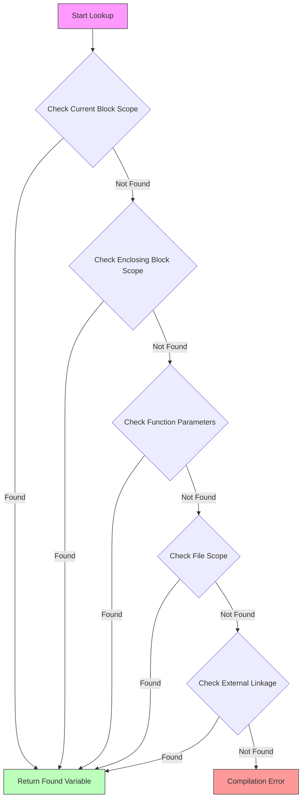
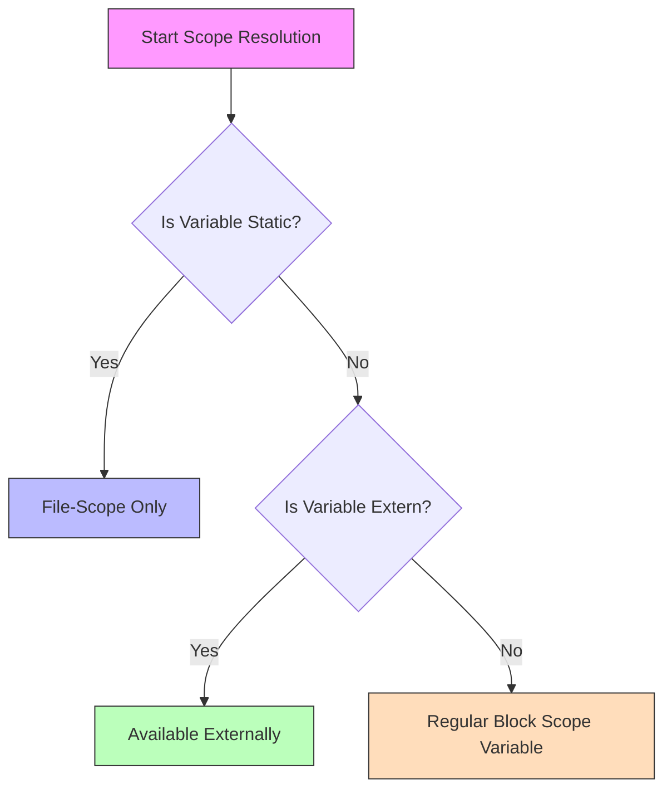
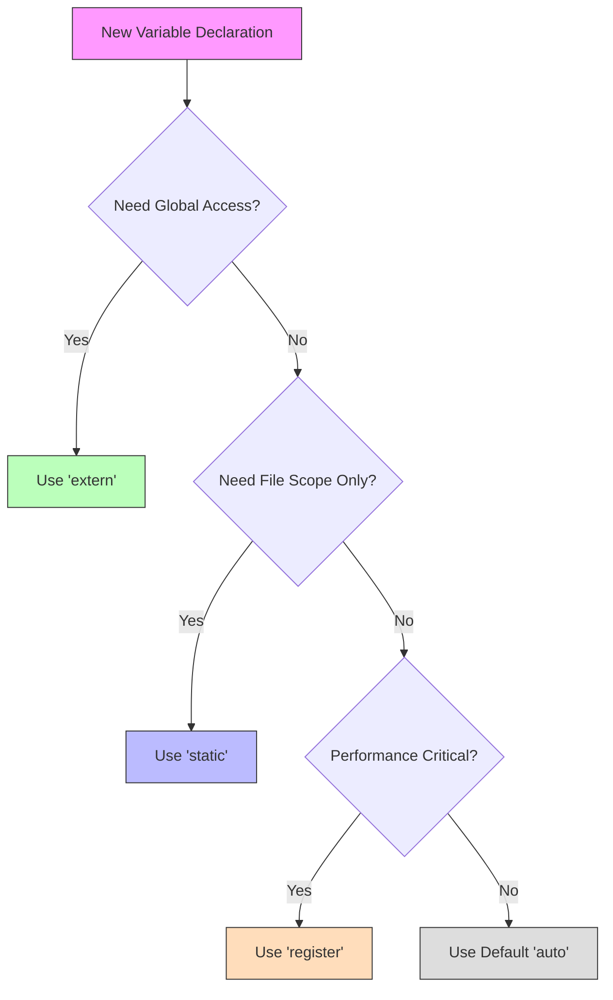
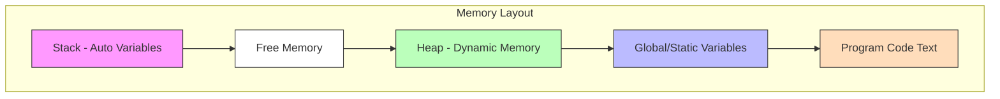
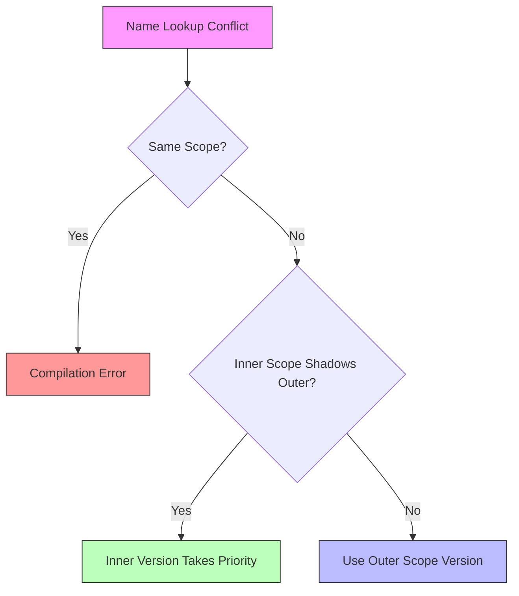
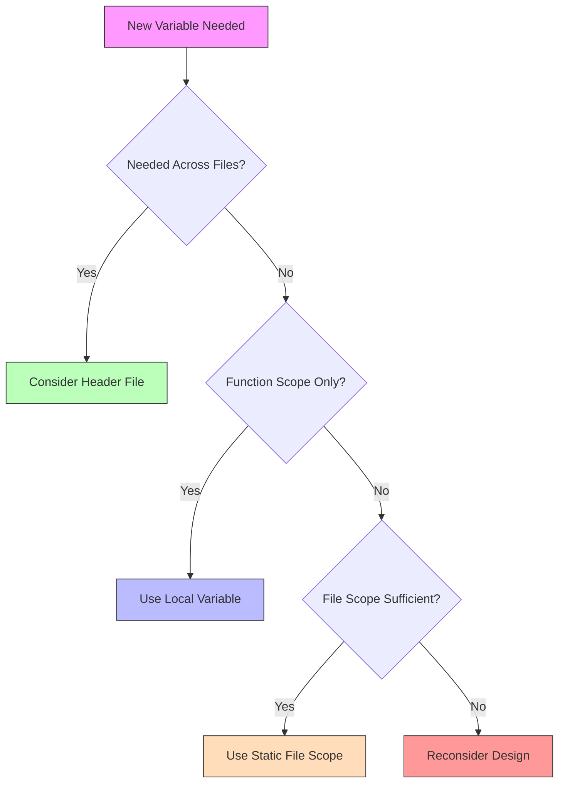

# Name Lookup in C: A Comprehensive Guide

## Table of Contents
1. [Introduction](#introduction)
2. [Scope Rules](#scope-rules)
3. [Name Visibility](#name-visibility)
4. [Storage Classes](#storage-classes)
5. [Name Lookup Process](#name-lookup-process)
6. [Common Issues and Best Practices](#common-issues-and-best-practices)

## Introduction

Name lookup in C is the process by which the compiler identifies and resolves identifiers (names) in your code. This process is fundamental to understanding how C programs work and how variables, functions, and other identifiers are accessed.

## Scope Rules

### 1. Block Scope
```c
{
    int x = 10;  // x is only visible within this block
}  // x goes out of scope here
```

### 2. Function Scope
- Applies only to labels declared within functions
- Labels are visible throughout the entire function regardless of where they're declared

### 3. File Scope (Global Scope)
```c
int global_var = 100;  // Visible to all functions in this file

void function1() {
    // Can access global_var here
}
```

### 4. Function Prototype Scope
- Applies to parameter names in function declarations
- Extends from the parameter declaration to the end of the declaration

## Name Visibility

### Scope Hierarchy
```
┌─────────────────────┐
│    Global Scope     │
│  ┌───────────────┐  │
│  │ Function Scope│  │
│  │ ┌───────────┐ │  │
│  │ │   Block   │ │  │
│  │ │   Scope   │ │  │
│  │ └───────────┘ │  │
│  └───────────────┘  │
└─────────────────────┘
```

### Name Shadowing
```c
int x = 10;  // Global x

void function() {
    int x = 20;  // Local x shadows global x
    {
        int x = 30;  // This x shadows both previous x's
    }
}
```

## Storage Classes

### 1. auto
- Default storage class for local variables
- Automatically allocated and deallocated
```c
void function() {
    auto int x = 10;  // 'auto' is implicit
}
```

### 2. static
- Preserves value between function calls
- For global variables, limits scope to current file
```c
static int counter = 0;  // File-scope static variable

void function() {
    static int calls = 0;  // Retains value between calls
    calls++;
}
```

### 3. extern
- Declares a variable that is defined elsewhere
```c
extern int global_variable;  // Declaration
```

### 4. register
- Suggests to store variable in CPU register
```c
register int counter = 0;  // Hint to compiler
```

## Name Lookup Process



## Variable Scope Resolution



## Storage Class Decision



## Memory Organization



## Name Collision Resolution



## Best Practices Decision Flow



## Summary

Name lookup in C follows these flowcharts to determine:
- How variables are found and accessed
- Which scope takes precedence
- How storage classes affect visibility
- How to resolve naming conflicts
- Best practices for variable declarations

Understanding these flows helps in:
- Writing maintainable code
- Avoiding naming conflicts
- Managing variable lifetime
- Controlling symbol visibility
- Debugging scope-related issues

Remember that proper name lookup understanding helps prevent common programming errors and leads to more maintainable and robust code.
